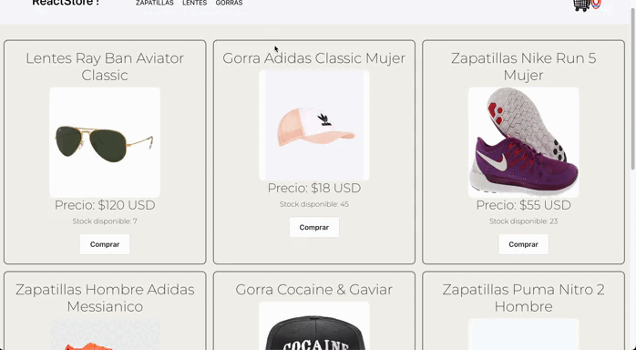
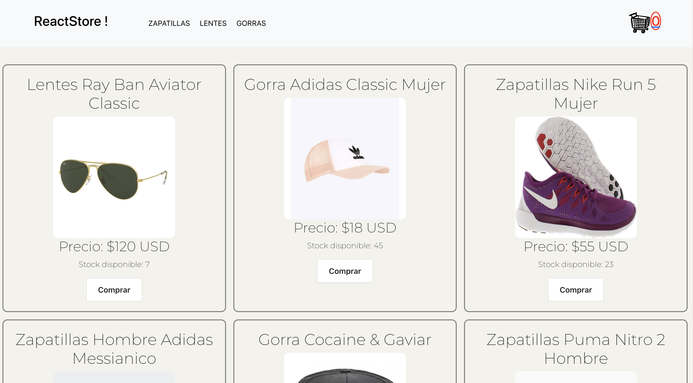
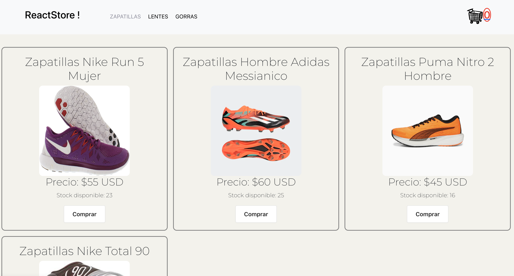
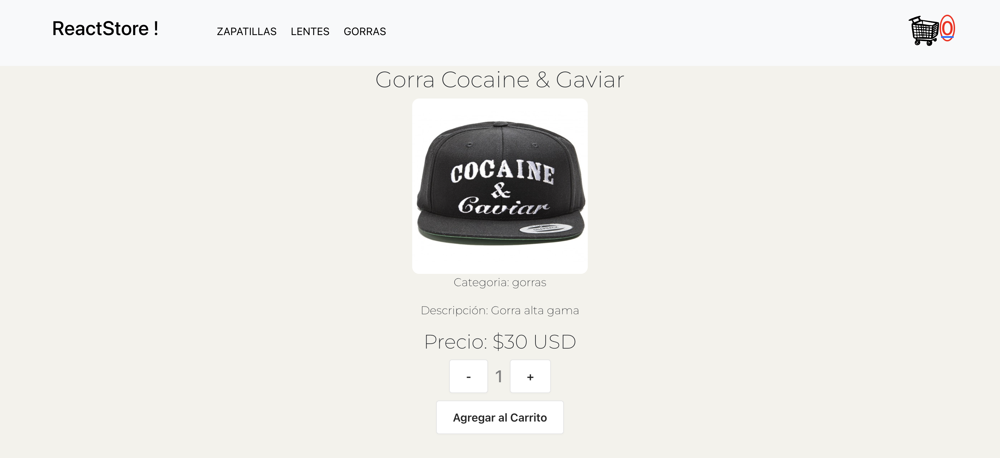
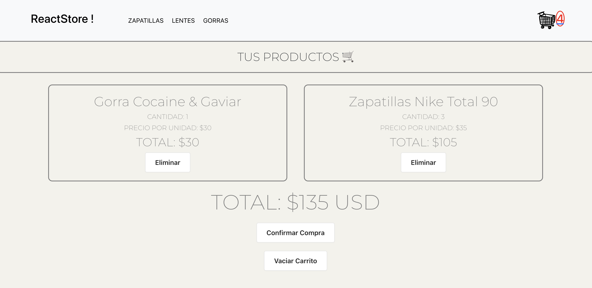
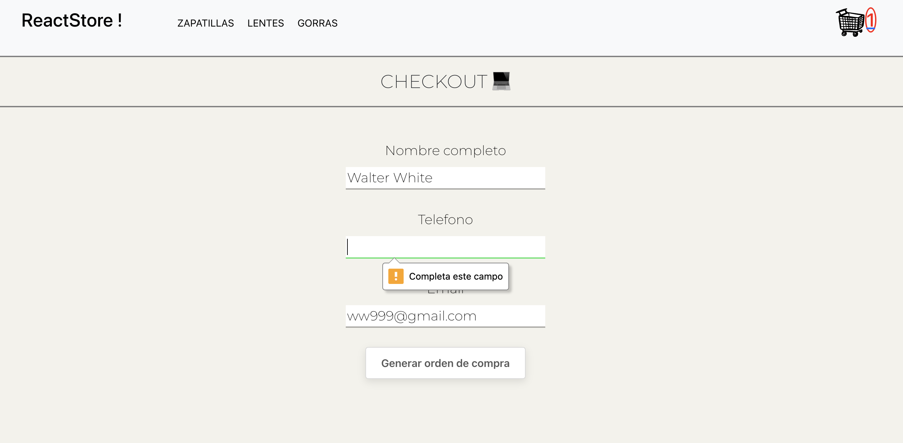
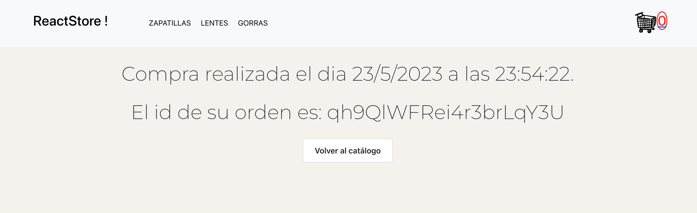
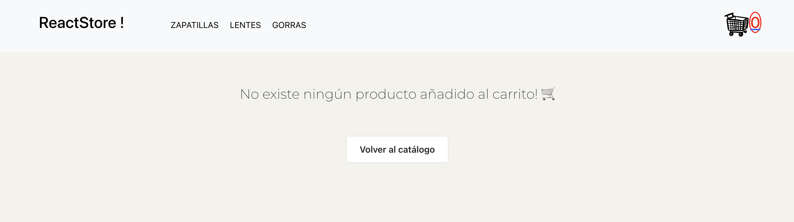

# Ecommerce ReactStore !

Este proyecto es un ecommerce desarrollado en React, utilizando HTML, CSS, JavaScript, Bootstrap y Firebase.



## Descripción

El proyecto de ecommerce en React es una aplicación web que permite a los usuarios explorar y comprar productos en línea. Incluye características como la visualización de productos, el agregado de productos al carrito de compras y la finalización de la compra devolviendo al usuario un código de orden de compra.

## Tecnologías utilizadas

- React: Biblioteca de JavaScript para construir interfaces de usuario.
- HTML: Lenguaje de marcado para estructurar el contenido web.
- CSS: Lenguaje de estilo para diseñar la apariencia del sitio web.
- JavaScript: Lenguaje de programación para agregar interactividad.
- Bootstrap: Framework CSS para facilitar el diseño y la maquetación.
- Firebase: Plataforma en la nube para el desarrollo de aplicaciones web y móviles.

## Instalación

Sigue los siguientes pasos para ejecutar el programa en tu máquina local:

1. Clona este repositorio en tu máquina:
```bash
git clone https://github.com/Pabl0VC/React_Coderhouse.git
```
2. Accede al directorio del proyecto:
```bash
cd React_Coderhouse
```
3. Instala las dependencias del proyecto utilizando npm (o yarn):
```bash
npm install --save @testing-library/jest-dom@^5.16.5
npm install --save @testing-library/react@^13.4.0
npm install --save @testing-library/user-event@^13.5.0
npm install --save bootstrap@^5.2.3
npm install --save firebase@^9.22.0
npm install --save react@^18.2.0
npm install --save react-bootstrap@^2.7.3
npm install --save react-dom@^18.2.0
npm install --save react-router-dom@^6.11.0
npm install --save react-scripts@5.0.1
npm install --save web-vitals@^2.1.4
```

Inicia la aplicación:
```bash
  npm run start
```

## Galería de imágenes

Catálogo completo de productos:


Catálogo Zapatillas:


Selección producto:


Productos agregado al carrito:


Checkout con campos obligatorios:


Orden de compra:


Sin productos en carrito:
